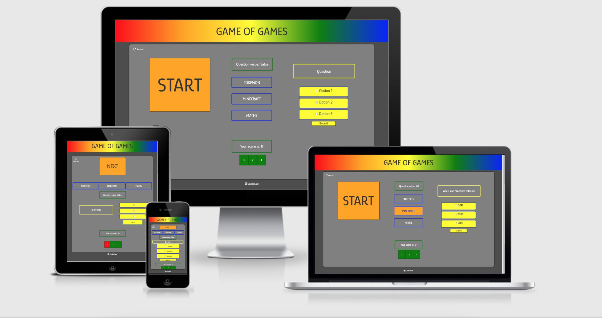
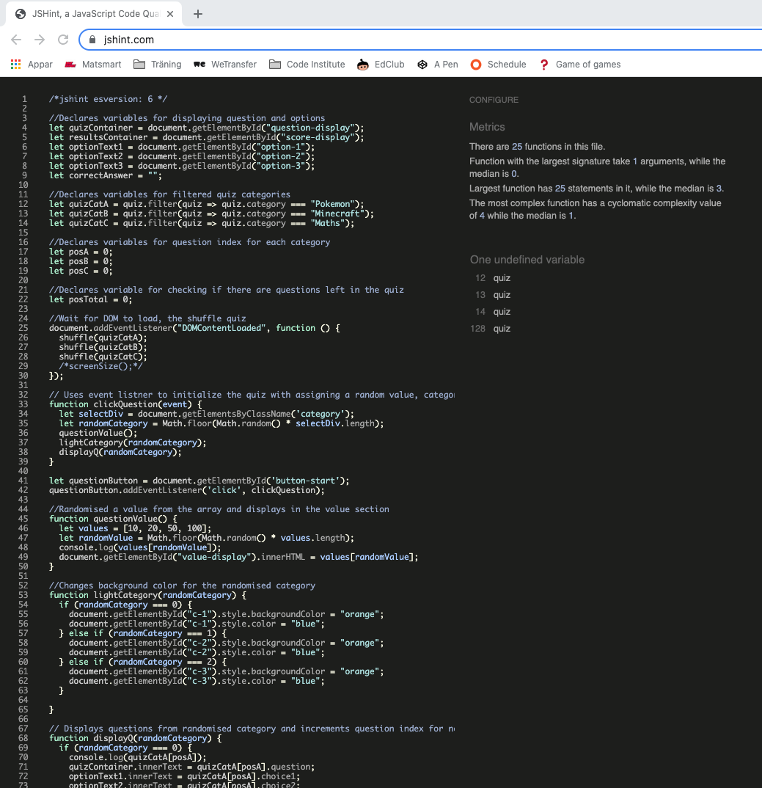
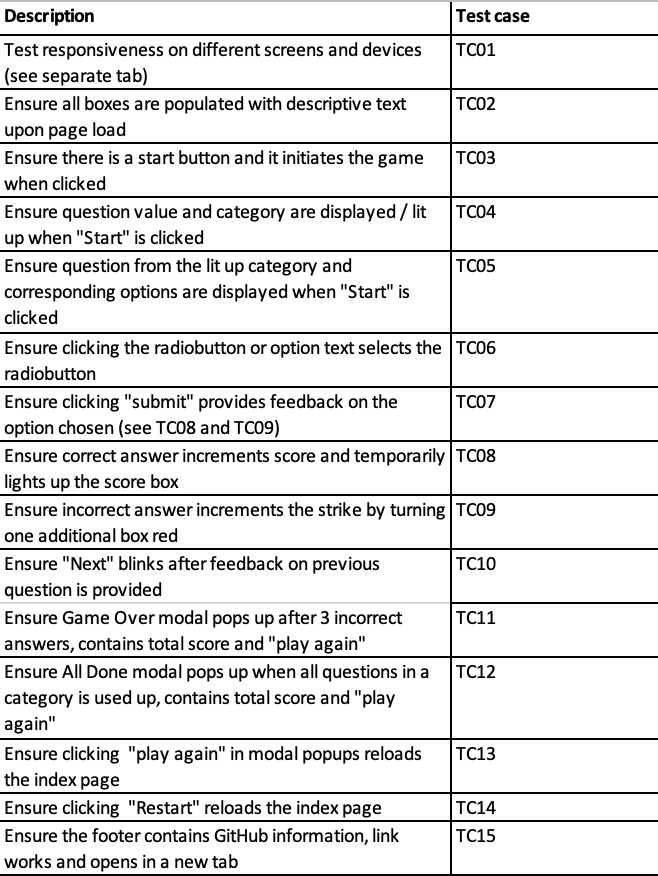

# Game of games 

## Purpose

Game of games is a kids' quiz game with randomised question values and questions. It is a site that hopes to provide a fun, interactive and educational moment for kids, letting them interact with the page and answers quiz questions in child friendly categories.

The site was built using HTML, CSS, User Centric Design, JavaScript Fundamentals and Interactive Frontend Development.

A full list of technologies used can be found in the technologies section of this document. Note that GitHub as of March 2021 automatically creates a Table of Contents for the README file.

The live website can be found [here](https://ceciliaswe.github.io/portfolio-2nd/index.html)

## Game of games Responsive Website

 

*** 
## User Experience (UX)

This website was created to showcase my knowledge of HTML, CSS & JavaScript and to provide users with some entertainment in the form of an online quiz game featuring categories for Pokemon, Minecraft and Maths. The game should be intuitive, simple to interact with and give feedback to the user.

Site Goals:

* To showcase my skills in HTML, CSS and JavaScript.
* To provide users with an interactive game to play.
* To create an fun, interactive game that makes the user want to stay and play, and also return to the website.

### User stories

* As a user, I want to easily understand the main purpose of the site.
* As a user, I want to the game to be self explanatory
* As a user, I want to be able to start a game when I am ready.
* As a user, I want to know whether my guess was successful or not.
* As a user, I want to see my scores increase as I answer correctly.
* As a user, I want to know when the game is over.
* As a user, I want a way to start a new game when the current game has ended.
* As a user, I want to improve my previous score.

### Wireframes
Wireframes created usig Balsamiq are uploaded to a separate folder - [View](wireframes_balsamiq/Wireframe_P2_.pdf)

The game consists of:
(1) Large start-button initiating the game, (2) randomising the question value, (3) randomising the category, and (4) displays a questions and answer options within the category. When user selects an answer, either (5) the score is incremented by the value of the question or (6) a "life" is lost. Game is over when 3 lives are lost, or all questions in a category have been displayed.

### Design

#### Color Scheme
Being a kids game, the color scheme chosen are shades of the base colors. They bring contrast and a sense of recognition to the game. Green and red are intuitively used for the strikes left / questions wrong sections as well as the question value and score sections, while yellow, blue and orange are used for the question button, categories and question / options sections.

#### Imagery
No physical images will be used on the site.
	
#### Typography
The font used for my website is "Glory". The font is provided by Google Fonts.

#### Differences to Design
Only 3 categories was included in the final game instead of 4.

##### Return to [top](#game-of-games)

## Features
The application consists of one single page, with modals to popup when game is over. 

### Existing features

- __Play button__

  - Clicking "Play" initiates the game; randomising a value (being displayed in the value box), a category (lighting up in orange) and displaying a question with corresponding options.
  - This section will allow the user to control both when to initiate the game and when to display the next questions (button is the displaying "Next"). 

- __Value box__

  - The value box displays the randomised value, letting the user know how much this questions is worth.

- __Category section__

  - A randomised category will light up in orange, letting the user know what category the questions is from

- __Question and option sections__

  - Displays the questions and corresponding options.
  - This section will allow the user to select one of the options by clicking on the radiobutton or option text.

- __Submit button__

  - Clicking "Submit" will either (1) increment "Your Score is:" by the value randomised for the questions (and the score box blinks in green for clear feedback that the answer was correct) or (2) turn one of the 3 strikes/lives red and replace the numver with an "X".
  - This section will allow the user to control when to submit the chosen option. 

- __Score box__

  - The score box displays the accumulkated score for the round of the quiz and is incremented by the value randomised for the question if the answer is correct
  - This section gives visual feedback if answer is corract - the score box temporarily lights up in green.
  
- __Strike box__

  - Displays the chances left before game over turns one of the 3 strikes/lives red and replace the numver with an "X" if the answer is incorrect.
  - This section gives the user feddback on chances left

- __Game over All done popups__

  - Corresponding modal will popup and let the user know that the Game is over, the reason for game over and their total score. 
  - This section gives the user the option to chose to play again or close the modal.

- __Restart__

  - Allows the user to restart the game at any time 

### Future features
* A larger set of quiz questions and categories.
* Introduction of game modes "Easy" or "Hard" to adjust question difficulty to suit different ages.
* Implement a timer function and allow the user to chose between a set number of attempts and/or a time limit.

##### Return to [top](#game-of-games)

## Technologies
### Languages used
* HTML5
	* This project uses HTML5 as the main language for content and structure of the Website.
* CSS3
	* This project uses CSS3 for Website styling
* Javascript
	*  This project uses Javascript for the required logic to allow for interactivity

### Frameworks, Libraries & Programs used
* [Font Awesome](https://fontawesome.com/)
	* Font awesome Icons are used 
* [Google Fonts](https://fonts.google.com/)
	* Google fonts are used throughout the project to import the relevant fonts
* [GitHub](https://github.com/)
	* GithHub is the hosting site used to store the source code for the Website and [Git Pages](https://pages.github.com/) is used for the deployment of the live site.
* [GitPod](https://gitpod.io/)
	* GitPod is used as version control software to commit and push code to the GitHub repository where the source code is stored.
* [Google Chrome Developer Tools](https://developers.google.com/web/tools/chrome-devtools)
	* Google chromes built in developer tools are used to inspect page elements and help debug issues with the site layout and test different CSS styles.
* [balsamiq Wireframes](https://balsamiq.com/wireframes/)
	* Balsamiq was used to create wireframes and UX design during the planning and design process.
* [Am I Responsive?](http://ami.responsivedesign.is/)
	* Used to generate the screenshots for responsive design.
* [Favicon](https://favicon.io/)
	* Used to generate the questionmark favicon
	
##### Return to [top](#game-of-games)

## Testing
Testing is required on the JavaScript quiz game. All features and user stories documented in the README are to be tested.

### Validation
The W3C Markup Validator, W3C CSS Validator Services and JSHint will be used to validate the code. All pages of the final website passed validation without relevant errors or warnings (see comments for JShint below).
-   [W3C Markup Validator](https://validator.w3.org/nu/?showsource=yes&doc=https%3A%2F%2Fceciliaswe.github.io%2Fportfolio-2nd%2Findex.html)
-   [W3C CSS Validator](https://jigsaw.w3.org/css-validator/validator?uri=https%3A%2F%2Fceciliaswe.github.io%2Fportfolio-2nd%2Findex.html&profile=css3svg&usermedium=all&warning=1&vextwarning=&lang=sv) 
-   [JSHint](https://jshint.com/)  
-    
	* All warnings relating to ES6 syntax are expected and ignored (and are removed by adding /*jshint esversion: 6 */)
	* Warning relating to "quiz" being a undefined variable: warning is issues as the quizquestions are in a separate .js. This is expected and also ignored.

### Fixed warnings and errors

- Button element cannot be descendant of anchor element and vice versa, resolved by wrapping anchor element in a div instead and style as a button (for modal "Play again").
- All duplicate ids removed
- JShint issued warning W066 for setTimeout method, error was caused by the function being passed as string and was fixed by editing the syntax.

### User stories testing

ALl user stories and site functionality was tested. Full testing matrix can be found [here](miscellaneous/testing_matrix_portfolio-2nd.xlsx)

1. As a user, I want to easily understand the main purpose of the site. - TC02
2. As a user, I want to the game to be self explanatory – TC02, TC03
3. As a user, I want to be able to start a game when I am ready. – TC03
4. As a user, I want to know whether my guess was successful or not. – TC07, TC08, TC09
5. As a user, I want to see my scores increase as I answer correctly. - TC08
6. As a user, I want to know when the game is over – TC11, TC12
7. As a user, I want a way to start a new game when the current game has ended. – TC11, TC12
8. As a user, I want to improve my previous score. - TC11, TC12

### Further Testing 	

The site was testes to to ensure consistency across browsers and screen sizen. Full testing matrix can be found [here](miscellaneous/testing_matrix_portfolio-2nd.xlsx)

### Noted bugs

On mobile and tablet devices (not in Chrome Developer Tools), the following was noted:
* Category and strike boxes appears off center on <320 px screens. 					
* "Start" appears off center inside the div on tablet deviced displayed vertically. 					

##### Return to [top](#game-of-games)

## Deployment

### Project Creation
The project was created using the CI Gitpod Full Template.
1. Navigate to CI Gitpod Full Template [here] (https://github.com/Code-Institute-Org/gitpod-full-template) and click the 'Use this template' button.
2. Enter chosen repository name, then click "Create repository from template".
3. Navigate to the new repository on GitHub and click the Gitpod button to build the workspace.
4. The following commands were used for version control throughout the project:

git add filename - to add files to the staging area before committing.
git commit -m "commit message" - to commit changes to the local repository.
git push - to push committed changes to the GitHub repository.

### Local Deployment/Clone
As described on [GitHub Docs] (https://docs.github.com/en/repositories/creating-and-managing-repositories/cloning-a-repository)

1. Navigate to the GitHub Repository main page,
2. Above the list of files, click the Code drop down menu.
3. To clone the repository using HTTPS, under "Clone with HTTPS", click the icon. To clone the repository using an SSH key, including a certificate issued by your organization's SSH certificate authority, click Use SSH, then click the icon. To clone a repository using GitHub CLI, click Use GitHub CLI, then click the icon. 
4. Open Terminal.
5. Change the current working directory to the location where you want the cloned directory.
6. Type git clone, and then paste the URL you copied earlier.
7. Press Enter to create your local clone.

### Remote Deployment
Assuming you have cloned the repository, it is deployed to GitHub Pages through the below steps:

1. Log in to GitHub and locate the [GitHub Repository](https://github.com/CeciliaSwe/portfolio-1st)
2. Click the "Setting" button "Settings" Button.
3. In the left menu, scroll down to "Pages".
4. Under "Source", click the dropdown and select "Branch: master", then click "Save".
5. Once deployed, the now published site [link](https://ceciliaswe.github.io/portfolio-2nd/) is found in the "Pages" section.

### Fork project
This is used to propose changes to someone else's project or to use someone else's project as a starting point for your own idea. 

1. Navigate to the GitHub Repository you want to fork.
2. On the top right of the page under the header, click "Fork".

This will create a duplicate of the full project in your GitHub Repository.

##### Return to [top](#game-of-games)

## Credits

### Code
All code has been custom written for this project, with the exception of the shuffle function below which was only slightly modified. Other inspiration and tutoritals are credited as per below:

* The quiz is shuffled according to Fisher-Yates https://bost.ocks.org/mike/shuffle/.
* How to create a gradient background color - tutorial on [w3schools](https://www.w3schools.com/cssref/func_linear-gradient.asp)
* How to create a modal - tutorial on [w3schools](https://www.w3schools.com/howto/howto_css_modals.asp)
* How to use scripts to control blinking - tutorial on [w3.org](https://www.w3.org/TR/WCAG20-TECHS/SCR22.html) 
* How to create grid areas with CSS was - tutorial by [The Net Ninja](https://www.youtube.com/watch?v=tPosqmwIx0w)

### Acknowledgements
-   To my Mentor [Chris Quinn](https://github.com/10xOXR) for guidance and pushing me to make smart choices.
-   To CI Tutors for pointing in the right direction.

##### Return to [top](#game-of-games)

